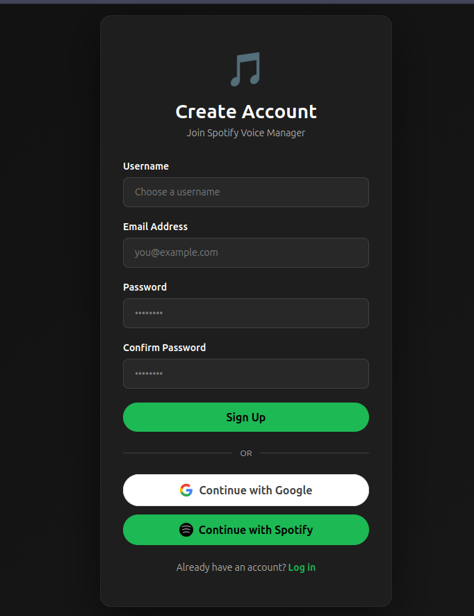
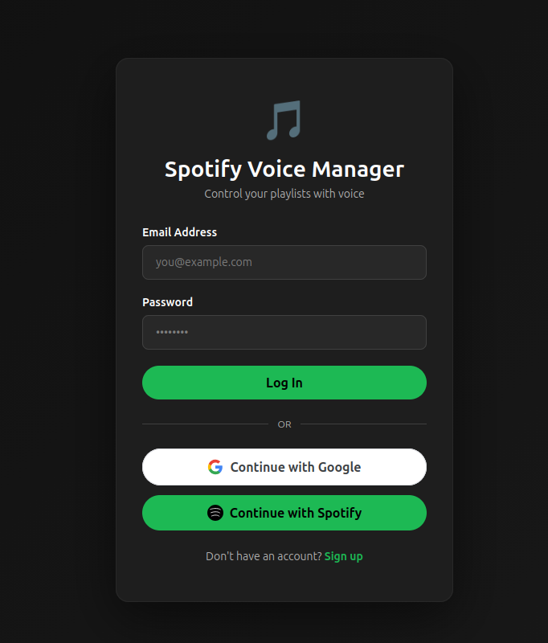
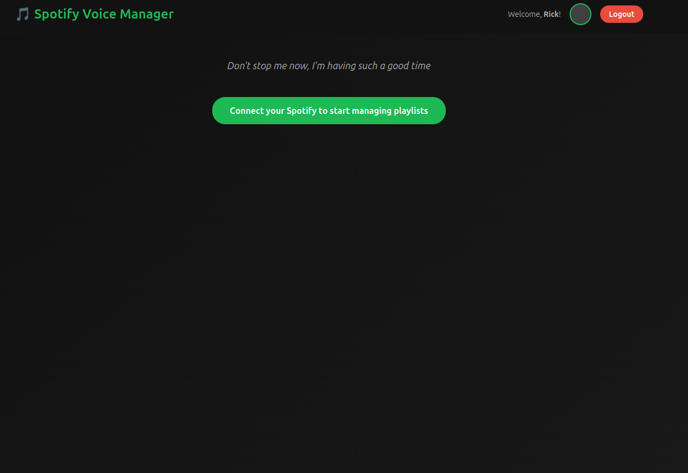

# Spotify Voice Manager

A modern web-based SaaS application for managing Spotify playlists with voice commands and AI-powered suggestions. Built with Django backend and React frontend.

## How it looks like

### Signup page:


### Login page:


### Landing page when spotify is not connected:


## Features

- 🎤 Voice command recognition
- 🎵 Create and manage playlists
- ➕ Add/remove songs from playlists
- 🤖 AI-powered command parsing
- 🎨 Modern responsive web interface
- 🔐 Secure user authentication
- 📱 Mobile-friendly design

## Tech Stack

### Backend
- Django 4.2
- Django REST Framework
- PostgreSQL/SQLite
- Spotipy (Spotify API)
- OpenAI (AI command parsing)

### Frontend
- React 18+ with TypeScript
- Tailwind CSS
- Axios
- React Router

## Quick Start

### Prerequisites
- Python 3.8+
- Node.js 16+
- npm or yarn

### Installation

See [SETUP.md](SETUP.md) for detailed installation instructions.

**Quick version:**

```bash
# Backend
python3 -m venv venv
source venv/bin/activate
pip install -r requirements.txt
python manage.py migrate
python manage.py createsuperuser
python manage.py runserver

# Frontend (in another terminal)
cd frontend
npm install
npm start
```

## Project Structure

```
playlist-manager/
├── config/              # Django configuration
├── apps/
│   ├── core/           # Models & admin
│   ├── api/            # REST API
│   └── auth_app/       # Authentication
├── frontend/           # React TypeScript app
├── manage.py
├── requirements.txt
└── README.md
```

## API Endpoints

- `POST /api/auth/register/` - Register new user
- `POST /api/auth/login/` - Login user
- `GET /api/playlists/` - List playlists
- `POST /api/playlists/` - Create playlist
- `GET /api/playlists/{id}/` - Get playlist details
- `POST /api/playlists/{id}/add-song/` - Add song
- `POST /api/playlists/{id}/remove-song/` - Remove song

## Development

See [SETUP.md](SETUP.md) for detailed development instructions.

## Future Enhancements

- Spotify OAuth integration
- Advanced AI suggestions
- WebSocket real-time updates
- PWA support
- Analytics dashboard

## License

MIT License
